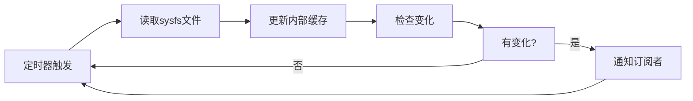

# Magic模块重构方案（精简版）

## 核心目标

将电池状态管理和充电控制功能从Android应用层分离到独立的后台服务，实现：

1. **进程隔离**: 核心功能运行在独立进程中，应用崩溃不影响底层服务
2. **缓存服务**: 后台服务以固定周期读取sysfs数据，应用直接从缓存获取状态
3. **充电控制**: 在服务中实现充电控制逻辑，应用仅下发配置
4. **专用优化**: 针对Android 16特定设备优化，无需考虑兼容性

## 架构设计

### 整体架构
```
┌─────────────────────────────────────────────────────────────┐
│                    Android应用层                              │
│  ┌─────────────────┐  ┌─────────────────┐  ┌─────────────────┐ │
│  │ MainActivity    │  │ BatteryInfoMgr  │  │ ChargeControl   │ │
│  └─────────────────┘  └─────────────────┘  └─────────────────┘ │
│           │                     │                     │       │
│           └─────────────────────┼─────────────────────┘       │
│                                 │                             │
│  ┌─────────────────────────────────────────────────────────┐ │
│  │              BatteryServiceConnector                     │ │
│  └─────────────────────────────────────────────────────────┘ │
└─────────────────────────────────────────────────────────────┘
                                │
                           Socket通信
                                │
┌─────────────────────────────────────────────────────────────┐
│                 Battery Service Daemon                       │
│  ┌─────────────────────────────────────────────────────────┐ │
│  │                核心服务进程                              │ │
│  │                                                         │ │
│  │  ┌─────────────┐  ┌─────────────┐  ┌─────────────────┐   │ │
│  │  │ 数据采集器   │  │ 状态缓存    │  │  充电控制器     │   │ │
│  │  │ (定时读取)   │  │ 管理器      │  │ (预留接口)      │   │ │
│  │  └─────────────┘  └─────────────┘  └─────────────────┘   │ │
│  │                                                         │ │
│  │  ┌─────────────┐  ┌─────────────┐                      │ │
│  │  │ Socket服务器 │  │ Root会话管理 │                      │ │
│  │  └─────────────┘  └─────────────┘                      │ │
│  └─────────────────────────────────────────────────────────┘ │
└─────────────────────────────────────────────────────────────┘
```

### 核心组件

#### 1. Battery Service Daemon (独立进程)
- **数据采集器**: 以固定周期（如1秒）读取/sys/class/power_supply/下的所有相关文件
- **状态缓存管理器**: 维护最新的电池状态数据，提供快速查询接口
- **充电控制器**: 处理充电阈值设置、充电控制等逻辑
- **Socket服务器**: 处理来自Android应用的请求
- **Root会话管理**: 维持单一root会话，避免频繁su切换

#### 2. BatteryServiceConnector (Android端)
- **连接管理**: 管理与Daemon的Socket连接
- **请求处理**: 发送配置请求、状态查询请求
- **数据解析**: 解析Daemon返回的状态数据

## 数据流程

### 数据采集流程


### 应用查询流程


### 充电控制流程


## Socket通信协议

### 消息类型
```java
// 查询类消息
public static final int MSG_GET_BATTERY_STATUS = 0x01;
public static final int MSG_GET_CHARGE_CONFIG = 0x02;

// 配置类消息
public static final int MSG_SET_CHARGE_THRESHOLD = 0x11;
public static final int MSG_SET_CHARGE_LIMIT = 0x12;
public static final int MSG_SET_CHARGE_MODE = 0x13;

// 控制类消息
public static final int MSG_START_CHARGE = 0x21;
public static final int MSG_STOP_CHARGE = 0x22;

// 系统类消息
public static final int MSG_PING = 0xF1;
public static final int MSG_GET_DAEMON_STATUS = 0xF2;
```

### 核心API

#### 获取电池状态
```json
// 请求
{
  "type": "get_battery_status"
}

// 响应
{
  "success": true,
  "data": {
    "timestamp": 1234567890,
    "battery": {
      "capacity": 85,
      "temp": 312,
      "voltage_now": 4200000,
      "current_now": 1500000,
      "status": "Charging"
    },
    "usb": {
      "online": true,
      "voltage_now": 5000000,
      "current_now": 2000000
    },
    "wireless": {
      "online": false
    }
  }
}
```

#### 设置充电阈值
```json
// 请求
{
  "type": "set_charge_threshold",
  "config": {
    "start_threshold": 20,
    "end_threshold": 80
  }
}

// 响应
{
  "success": true,
  "data": {
    "applied": true,
    "previous_config": {
      "start_threshold": 15,
      "end_threshold": 85
    }
  }
}
```

## 实现细节

### 1. 数据采集器实现
```cpp
class DataCollector {
private:
    std::vector<std::string> batteryFiles;
    std::vector<std::string> usbFiles;
    std::vector<std::string> wirelessFiles;
    std::thread collectorThread;
    std::atomic<bool> running{false};
    
public:
    void start() {
        running = true;
        collectorThread = std::thread(&DataCollector::collectLoop, this);
    }
    
    void stop() {
        running = false;
        if (collectorThread.joinable()) {
            collectorThread.join();
        }
    }
    
private:
    void collectLoop() {
        while (running) {
            auto startTime = std::chrono::steady_clock::now();
            
            // 读取所有文件
            BatteryData data = readAllFiles();
            
            // 更新缓存
            CacheManager::getInstance().updateBatteryData(data);
            
            // 计算下次采集时间（固定周期）
            auto elapsed = std::chrono::steady_clock::now() - startTime;
            auto sleepTime = std::chrono::milliseconds(1000) - elapsed;
            if (sleepTime.count() > 0) {
                std::this_thread::sleep_for(sleepTime);
            }
        }
    }
    
    BatteryData readAllFiles() {
        BatteryData data;
        
        // 读取电池相关文件
        for (const auto& file : batteryFiles) {
            data.battery[file] = readFile(file);
        }
        
        // 读取USB相关文件
        for (const auto& file : usbFiles) {
            data.usb[file] = readFile(file);
        }
        
        // 读取无线充电相关文件
        for (const auto& file : wirelessFiles) {
            data.wireless[file] = readFile(file);
        }
        
        data.timestamp = std::chrono::duration_cast<std::chrono::milliseconds>(
            std::chrono::system_clock::now().time_since_epoch()).count();
            
        return data;
    }
};
```

### 2. 缓存管理器实现
```cpp
class CacheManager {
private:
    BatteryData currentData;
    std::mutex dataMutex;
    static CacheManager instance;
    
public:
    static CacheManager& getInstance() {
        return instance;
    }
    
    void updateBatteryData(const BatteryData& newData) {
        std::lock_guard<std::mutex> lock(dataMutex);
        
        // 检查是否有变化
        bool hasChanges = (currentData.timestamp == 0) || 
                         (newData.battery != currentData.battery) ||
                         (newData.usb != currentData.usb) ||
                         (newData.wireless != currentData.wireless);
        
        if (hasChanges) {
            currentData = newData;
            
            // 通知订阅者（如果有）
            notifySubscribers();
        }
    }
    
    BatteryData getBatteryData() {
        std::lock_guard<std::mutex> lock(dataMutex);
        return currentData;
    }
    
private:
    void notifySubscribers() {
        // 实现订阅者通知逻辑
    }
};
```

### 3. Android端连接器实现
```java
public class BatteryServiceConnector {
    private static final String SOCKET_PATH = "/data/local/tmp/battery_service.sock";
    private SocketConnection connection;
    private Handler mainHandler = new Handler(Looper.getMainLooper());
    
    public interface BatteryDataListener {
        void onBatteryDataChanged(BatteryData data);
    }
    
    private BatteryDataListener listener;
    
    public void setBatteryDataListener(BatteryDataListener listener) {
        this.listener = listener;
    }
    
    public CompletableFuture<BatteryData> getBatteryStatus() {
        return CompletableFuture.supplyAsync(() -> {
            try {
                MagicRequest request = new MagicRequest.Builder()
                    .setType(MagicRequest.TYPE_GET_BATTERY_STATUS)
                    .build();
                    
                MagicResponse response = connection.sendRequest(request);
                if (response.isSuccess()) {
                    return BatteryData.fromJson(response.getData());
                }
            } catch (Exception e) {
                Log.e("BatteryServiceConnector", "获取电池状态失败", e);
            }
            return null;
        });
    }
    
    public CompletableFuture<Boolean> setChargeThreshold(int startThreshold, int endThreshold) {
        return CompletableFuture.supplyAsync(() -> {
            try {
                MagicRequest request = new MagicRequest.Builder()
                    .setType(MagicRequest.TYPE_SET_CHARGE_THRESHOLD)
                    .setChargeThreshold(startThreshold, endThreshold)
                    .build();
                    
                MagicResponse response = connection.sendRequest(request);
                return response.isSuccess();
            } catch (Exception e) {
                Log.e("BatteryServiceConnector", "设置充电阈值失败", e);
                return false;
            }
        });
    }
}
```

## 部署方案

### 1. Daemon安装
```bash
#!/bin/bash
# install_daemon.sh

DAEMON_PATH="/data/local/tmp/battery_service_daemon"
SOCKET_PATH="/data/local/tmp/battery_service.sock"

# 停止旧进程
pkill -f battery_service_daemon
rm -f $SOCKET_PATH

# 复制新daemon
cp battery_service_daemon $DAEMON_PATH
chmod 755 $DAEMON_PATH

# 设置root权限
chown root:root $DAEMON_PATH
chmod 4755 $DAEMON_PATH

# 启动daemon
$DAEMON_PATH &

echo "Battery Service Daemon installed and started"
```

### 2. Android端集成
```java
public class BatteryInfoManager {
    private BatteryServiceConnector serviceConnector;
    
    public BatteryInfoManager(Context context) {
        serviceConnector = new BatteryServiceConnector();
        serviceConnector.connect();
        
        // 设置数据变化监听
        serviceConnector.setBatteryDataListener(data -> {
            // 更新UI
            updateUI(data);
        });
    }
    
    public BatteryInfo getCurrentBatteryInfo() {
        try {
            // 从服务获取最新数据
            BatteryData data = serviceConnector.getBatteryStatus().get(1, TimeUnit.SECONDS);
            return convertToBatteryInfo(data);
        } catch (Exception e) {
            Log.e("BatteryInfoManager", "获取电池信息失败", e);
            return null;
        }
    }
    
    public void setChargeThreshold(int start, int end) {
        serviceConnector.setChargeThreshold(start, end)
            .thenAccept(success -> {
                if (success) {
                    Log.i("BatteryInfoManager", "充电阈值设置成功");
                } else {
                    Log.e("BatteryInfoManager", "充电阈值设置失败");
                }
            });
    }
}
```

## 充电控制功能预留

### 控制接口设计
```cpp
class ChargeController {
private:
    ChargeConfig currentConfig;
    
public:
    bool setChargeThreshold(int startThreshold, int endThreshold) {
        // 写入充电控制阈值
        std::string startPath = "/sys/class/power_supply/battery/charge_control_start_threshold";
        std::string endPath = "/sys/class/power_supply/battery/charge_control_end_threshold";
        
        if (writeFile(startPath, std::to_string(startThreshold)) &&
            writeFile(endPath, std::to_string(endThreshold))) {
            
            currentConfig.startThreshold = startThreshold;
            currentConfig.endThreshold = endThreshold;
            return true;
        }
        return false;
    }
    
    bool setChargeLimit(int limit) {
        std::string limitPath = "/sys/class/power_supply/battery/charge_control_limit";
        if (writeFile(limitPath, std::to_string(limit))) {
            currentConfig.limit = limit;
            return true;
        }
        return false;
    }
    
    bool enableCharging(bool enable) {
        // 实现充电开关控制
        std::string controlPath = "/sys/class/power_supply/battery/charging_enabled";
        return writeFile(controlPath, enable ? "1" : "0");
    }
};
```

## 性能优化

### 1. 固定周期采集
- **采集周期**: 1秒（可根据需要调整）
- **批量读取**: 一次系统调用读取多个文件
- **内存映射**: 对频繁读取的文件使用内存映射

### 2. 缓存优化
- **零拷贝**: 直接返回缓存数据，避免数据复制
- **时间戳**: 每次数据更新时记录时间戳
- **变化检测**: 只在数据变化时通知应用

### 3. 通信优化
- **连接复用**: 维持长连接，避免频繁建立连接
- **二进制协议**: 使用二进制协议减少序列化开销
- **压缩传输**: 对大数据包使用压缩

## 调试和监控

### 1. 日志系统
```cpp
class Logger {
public:
    enum Level { DEBUG, INFO, WARN, ERROR };
    
    static void log(Level level, const std::string& message) {
        auto now = std::chrono::system_clock::now();
        auto timestamp = std::chrono::duration_cast<std::chrono::milliseconds>(
            now.time_since_epoch()).count();
            
        std::string levelStr = getLevelString(level);
        printf("[%lld] [%s] %s\n", timestamp, levelStr.c_str(), message.c_str());
        
        // 同时写入日志文件
        writeToFile(timestamp, levelStr, message);
    }
    
private:
    static void writeToFile(long timestamp, const std::string& level, const std::string& message) {
        std::ofstream logFile("/data/local/tmp/battery_service.log", std::ios::app);
        if (logFile.is_open()) {
            logFile << "[" << timestamp << "] [" << level << "] " << message << std::endl;
            logFile.close();
        }
    }
};
```

### 2. 状态监控
```java
public class ServiceMonitor {
    public static void checkDaemonStatus() {
        BatteryServiceConnector connector = new BatteryServiceConnector();
        
        connector.getDaemonStatus()
            .thenAccept(status -> {
                Log.i("ServiceMonitor", "Daemon状态: " + status.toString());
                
                if (status.uptime > 24 * 60 * 60 * 1000) { // 超过24小时
                    Log.w("ServiceMonitor", "Daemon运行时间过长，建议重启");
                }
                
                if (status.memoryUsage > 50 * 1024 * 1024) { // 超过50MB
                    Log.w("ServiceMonitor", "Daemon内存使用过高: " + status.memoryUsage);
                }
            });
    }
}
```

## 总结

这个精简版的Magic模块方案专注于核心需求：

1. **进程隔离**: 核心功能运行在独立进程中，应用崩溃不影响底层服务
2. **缓存服务**: 后台服务以固定周期读取数据，应用从缓存获取状态
3. **充电控制**: 在服务中实现充电控制逻辑
4. **专用优化**: 针对Android 16特定设备优化

方案去除了不必要的兼容性考虑和用户评价相关内容，专注于技术实现和性能优化。