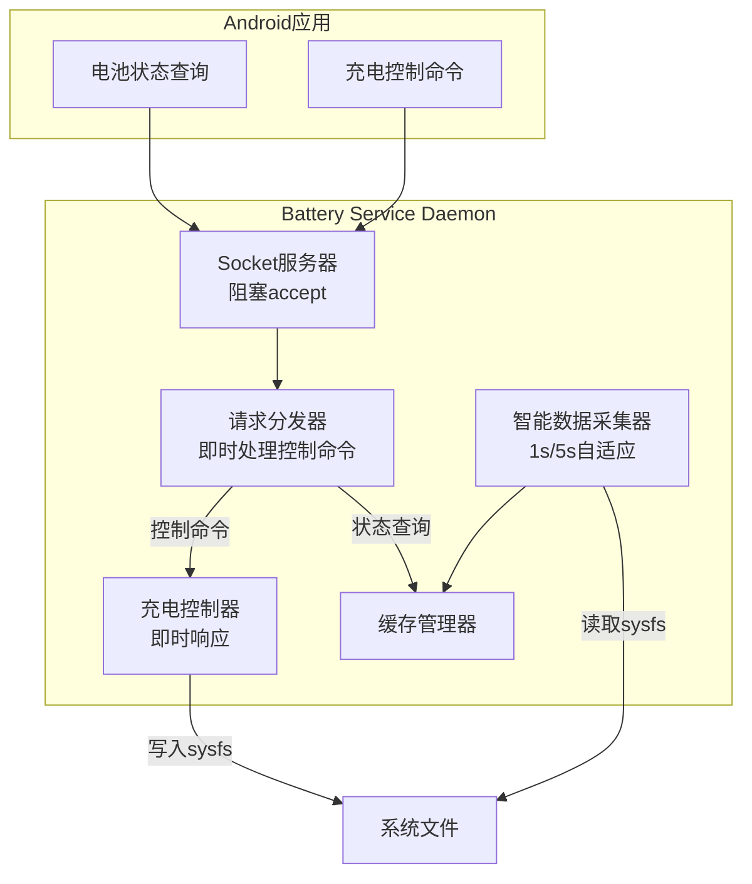

# 优化通信方案设计

## 核心设计思路

基于您的需求：
1. **事件驱动通信**：使用阻塞accept()替代轮询，减少CPU开销
2. **智能数据采集**：无连接时5秒间隔，有连接时1秒间隔
3. **控制信息即时响应**：控制命令立即处理，不等待数据采集周期

## 优化架构图



## 核心实现

### 1. 优化的Socket服务器

```cpp
class OptimizedSocketServer {
private:
    int serverFd;
    std::atomic<bool> running{true};
    std::atomic<int> activeClients{0};
    std::thread serverThread;
    
public:
    void start() {
        serverThread = std::thread([this]() {
            runServer();
        });
    }
    
    void stop() {
        running = false;
        if (serverThread.joinable()) {
            serverThread.join();
        }
    }
    
private:
    void runServer() {
        while (running) {
            // 阻塞等待连接，零CPU开销
            struct sockaddr_un clientAddr;
            socklen_t clientLen = sizeof(clientAddr);
            int clientFd = accept(serverFd, (struct sockaddr*)&clientAddr, &clientLen);
            
            if (clientFd >= 0) {
                activeClients++;
                Logger::info("Client connected, active clients: " + std::to_string(activeClients));
                
                // 立即处理客户端请求
                handleClient(clientFd);
            } else if (errno != EINTR) {
                Logger::error("Accept error: " + std::string(strerror(errno)));
            }
        }
    }
    
    void handleClient(int clientFd) {
        try {
            // 读取请求
            std::string request = readRequest(clientFd);
            
            // 立即处理请求
            std::string response = processRequest(request);
            
            // 发送响应
            sendResponse(clientFd, response);
            
        } catch (const std::exception& e) {
            Logger::error("Error handling client: " + std::string(e.what()));
        }
        
        close(clientFd);
        activeClients--;
        Logger::info("Client disconnected, active clients: " + std::to_string(activeClients));
    }
    
    std::string processRequest(const std::string& requestData) {
        try {
            nlohmann::json request = nlohmann::json::parse(requestData);
            std::string type = request["type"];
            
            // 控制命令：立即处理
            if (type == "set_charge_threshold" || 
                type == "set_charge_limit" || 
                type == "enable_charging") {
                
                return processControlCommand(request);
            }
            
            // 状态查询：从缓存获取
            if (type == "get_battery_status") {
                return processStatusQuery(request);
            }
            
            // 其他请求
            return processOtherRequest(request);
            
        } catch (const std::exception& e) {
            nlohmann::json response;
            response["success"] = false;
            response["error"] = e.what();
            return response.dump();
        }
    }
    
    std::string processControlCommand(const nlohmann::json& request) {
        std::string type = request["type"];
        nlohmann::json response;
        response["success"] = true;
        
        try {
            if (type == "set_charge_threshold") {
                auto config = request["config"];
                int startThreshold = config["start_threshold"];
                int endThreshold = config["end_threshold"];
                
                // 立即应用充电阈值
                bool success = ChargeController::getInstance().setChargeThreshold(startThreshold, endThreshold);
                response["success"] = success;
                response["data"]["applied"] = success;
                response["data"]["timestamp"] = getCurrentTimestamp();
                
                Logger::info("Charge threshold set: " + std::to_string(startThreshold) + 
                           "-" + std::to_string(endThreshold) + " (success: " + 
                           std::to_string(success) + ")");
                
            } else if (type == "set_charge_limit") {
                int limit = request["limit"];
                bool success = ChargeController::getInstance().setChargeLimit(limit);
                response["success"] = success;
                response["data"]["applied"] = success;
                response["data"]["timestamp"] = getCurrentTimestamp();
                
                Logger::info("Charge limit set: " + std::to_string(limit) + 
                           " (success: " + std::to_string(success) + ")");
                
            } else if (type == "enable_charging") {
                bool enable = request["enable"];
                bool success = ChargeController::getInstance().enableCharging(enable);
                response["success"] = success;
                response["data"]["applied"] = success;
                response["data"]["timestamp"] = getCurrentTimestamp();
                
                Logger::info("Charging " + std::string(enable ? "enabled" : "disabled") + 
                           " (success: " + std::to_string(success) + ")");
            }
            
        } catch (const std::exception& e) {
            response["success"] = false;
            response["error"] = e.what();
        }
        
        return response.dump();
    }
    
    std::string processStatusQuery(const nlohmann::json& request) {
        nlohmann::json response;
        response["success"] = true;
        
        // 从缓存获取最新数据
        BatteryData data = CacheManager::getInstance().getBatteryData();
        response["data"] = data.toJson();
        
        return response.dump();
    }
};
```

### 2. 智能数据采集器

```cpp
class SmartDataCollector {
private:
    std::atomic<bool> running{true};
    std::atomic<bool> hasActiveClients{false};
    std::thread collectorThread;
    
    // 采集间隔
    const std::chrono::milliseconds ACTIVE_INTERVAL{1000};  // 有客户端时1秒
    const std::chrono::milliseconds IDLE_INTERVAL{5000};   // 无客户端时5秒
    
public:
    void start() {
        collectorThread = std::thread([this]() {
            collectLoop();
        });
    }
    
    void stop() {
        running = false;
        if (collectorThread.joinable()) {
            collectorThread.join();
        }
    }
    
    void onClientConnected() {
        hasActiveClients = true;
        Logger::info("Client connected, switching to 1s collection interval");
    }
    
    void onClientDisconnected() {
        hasActiveClients = false;
        Logger::info("All clients disconnected, switching to 5s collection interval");
    }
    
private:
    void collectLoop() {
        while (running) {
            auto startTime = std::chrono::steady_clock::now();
            
            try {
                // 采集数据
                BatteryData data = readAllFiles();
                CacheManager::getInstance().updateBatteryData(data);
                
                // 记录采集间隔变化
                static bool lastClientState = false;
                if (lastClientState != hasActiveClients) {
                    Logger::info("Collection interval changed to " + 
                               std::string(hasActiveClients ? "1s" : "5s"));
                    lastClientState = hasActiveClients;
                }
                
            } catch (const std::exception& e) {
                Logger::error("Data collection error: " + std::string(e.what()));
            }
            
            // 根据客户端状态决定采集间隔
            auto interval = hasActiveClients ? ACTIVE_INTERVAL : IDLE_INTERVAL;
            auto elapsed = std::chrono::steady_clock::now() - startTime;
            auto sleepTime = interval - elapsed;
            
            if (sleepTime.count() > 0) {
                std::this_thread::sleep_for(sleepTime);
            }
        }
    }
    
    BatteryData readAllFiles() {
        BatteryData data;
        
        // 读取电池相关文件
        data.battery["capacity"] = readFile("/sys/class/power_supply/battery/capacity");
        data.battery["temp"] = readFile("/sys/class/power_supply/battery/temp");
        data.battery["voltage_now"] = readFile("/sys/class/power_supply/battery/voltage_now");
        data.battery["current_now"] = readFile("/sys/class/power_supply/battery/current_now");
        data.battery["status"] = readFile("/sys/class/power_supply/battery/status");
        data.battery["health"] = readFile("/sys/class/power_supply/battery/health");
        data.battery["charge_counter"] = readFile("/sys/class/power_supply/battery/charge_counter");
        data.battery["charge_full"] = readFile("/sys/class/power_supply/battery/charge_full");
        data.battery["cycle_count"] = readFile("/sys/class/power_supply/battery/cycle_count");
        
        // 读取USB相关文件
        data.usb["online"] = readFile("/sys/class/power_supply/usb/online");
        data.usb["voltage_now"] = readFile("/sys/class/power_supply/usb/voltage_now");
        data.usb["current_now"] = readFile("/sys/class/power_supply/usb/current_now");
        
        // 读取无线充电相关文件
        data.wireless["online"] = readFile("/sys/class/power_supply/wireless/online");
        data.wireless["voltage_now"] = readFile("/sys/class/power_supply/wireless/voltage_now");
        data.wireless["current_now"] = readFile("/sys/class/power_supply/wireless/current_now");
        
        data.timestamp = getCurrentTimestamp();
        
        return data;
    }
    
    std::string readFile(const std::string& path) {
        std::ifstream file(path);
        if (!file.is_open()) {
            return "";
        }
        
        std::string content;
        std::getline(file, content);
        file.close();
        
        // 去除空白字符
        content.erase(0, content.find_first_not_of(" \t\n\r"));
        content.erase(content.find_last_not_of(" \t\n\r") + 1);
        
        return content;
    }
    
    long getCurrentTimestamp() {
        return std::chrono::duration_cast<std::chrono::milliseconds>(
            std::chrono::system_clock::now().time_since_epoch()).count();
    }
};
```

### 3. 集成的主服务

```cpp
class OptimizedBatteryService {
private:
    OptimizedSocketServer socketServer;
    SmartDataCollector dataCollector;
    
public:
    void start() {
        Logger::info("Starting Optimized Battery Service Daemon...");
        
        // 启动数据采集器
        dataCollector.start();
        
        // 启动Socket服务器
        socketServer.start();
        
        // 设置客户端连接回调
        socketServer.setClientConnectedCallback([this]() {
            dataCollector.onClientConnected();
        });
        
        socketServer.setClientDisconnectedCallback([this]() {
            dataCollector.onClientDisconnected();
        });
        
        Logger::info("Optimized Battery Service Daemon started successfully");
    }
    
    void stop() {
        Logger::info("Stopping Optimized Battery Service Daemon...");
        
        socketServer.stop();
        dataCollector.stop();
        
        Logger::info("Optimized Battery Service Daemon stopped");
    }
};
```

### 4. Android端优化连接器

```java
public class OptimizedBatteryServiceConnector {
    private static final String TAG = "OptimizedBatteryConnector";
    private static final String SOCKET_PATH = "/data/local/tmp/battery_service.sock";
    private static final int CONNECT_TIMEOUT = 2000; // 2秒连接超时
    
    public CompletableFuture<Boolean> setChargeThreshold(int startThreshold, int endThreshold) {
        return CompletableFuture.supplyAsync(() -> {
            try (Socket socket = new Socket();
                 DataOutputStream output = new DataOutputStream(socket.getOutputStream());
                 DataInputStream input = new DataInputStream(socket.getInputStream())) {
                
                // 建立连接
                socket.connect(new java.net.UnixDomainSocketAddress(SOCKET_PATH), CONNECT_TIMEOUT);
                
                // 构建控制命令
                JSONObject request = new JSONObject();
                request.put("type", "set_charge_threshold");
                
                JSONObject config = new JSONObject();
                config.put("start_threshold", startThreshold);
                config.put("end_threshold", endThreshold);
                request.put("config", config);
                
                // 发送请求
                byte[] requestData = request.toString().getBytes("UTF-8");
                output.writeInt(requestData.length);
                output.write(requestData);
                output.flush();
                
                // 接收响应
                int responseLength = input.readInt();
                byte[] responseData = new byte[responseLength];
                input.readFully(responseData);
                
                JSONObject response = new JSONObject(new String(responseData, "UTF-8"));
                
                if (response.getBoolean("success")) {
                    Log.i(TAG, "Charge threshold set successfully: " + startThreshold + "-" + endThreshold);
                    return true;
                } else {
                    Log.e(TAG, "Failed to set charge threshold: " + response.getString("error"));
                    return false;
                }
                
            } catch (Exception e) {
                Log.e(TAG, "Error setting charge threshold", e);
                return false;
            }
        });
    }
    
    public CompletableFuture<BatteryData> getBatteryStatus() {
        return CompletableFuture.supplyAsync(() -> {
            try (Socket socket = new Socket();
                 DataOutputStream output = new DataOutputStream(socket.getOutputStream());
                 DataInputStream input = new DataInputStream(socket.getInputStream())) {
                
                // 建立连接
                socket.connect(new java.net.UnixDomainSocketAddress(SOCKET_PATH), CONNECT_TIMEOUT);
                
                // 构建状态查询请求
                JSONObject request = new JSONObject();
                request.put("type", "get_battery_status");
                
                // 发送请求
                byte[] requestData = request.toString().getBytes("UTF-8");
                output.writeInt(requestData.length);
                output.write(requestData);
                output.flush();
                
                // 接收响应
                int responseLength = input.readInt();
                byte[] responseData = new byte[responseLength];
                input.readFully(responseData);
                
                JSONObject response = new JSONObject(new String(responseData, "UTF-8"));
                
                if (response.getBoolean("success")) {
                    return BatteryData.fromJson(response.getJSONObject("data"));
                } else {
                    Log.e(TAG, "Failed to get battery status: " + response.getString("error"));
                    return null;
                }
                
            } catch (Exception e) {
                Log.e(TAG, "Error getting battery status", e);
                return null;
            }
        });
    }
}
```

## 性能优势

### 1. CPU使用率优化
- **无客户端时**: Socket服务器阻塞等待，数据采集5秒间隔，CPU使用率接近0
- **有客户端时**: 数据采集1秒间隔，但避免了频繁的轮询开销

### 2. 响应性优化
- **控制命令**: 即时处理，不等待数据采集周期
- **状态查询**: 从缓存获取，响应时间<10ms
- **连接建立**: 阻塞accept()，连接建立后立即处理

### 3. 资源使用优化
- **内存**: 只维护一份缓存数据，按需更新
- **网络**: Unix Socket通信，开销最小
- **存储**: 日志文件轮转，避免无限增长

## 监控指标

```cpp
class PerformanceMonitor {
private:
    std::atomic<long> requestCount{0};
    std::atomic<long> controlCommandCount{0};
    std::atomic<long> statusQueryCount{0};
    std::chrono::steady_clock::time_point startTime;
    
public:
    void recordRequest() {
        requestCount++;
    }
    
    void recordControlCommand() {
        controlCommandCount++;
    }
    
    void recordStatusQuery() {
        statusQueryCount++;
    }
    
    void reportStats() {
        auto uptime = std::chrono::duration_cast<std::chrono::seconds>(
            std::chrono::steady_clock::now() - startTime).count();
            
        Logger::info("Performance Stats:");
        Logger::info("  Uptime: " + std::to_string(uptime) + "s");
        Logger::info("  Total requests: " + std::to_string(requestCount));
        Logger::info("  Control commands: " + std::to_string(controlCommandCount));
        Logger::info("  Status queries: " + std::to_string(statusQueryCount));
        
        if (uptime > 0) {
            Logger::info("  Requests/sec: " + std::to_string(requestCount / uptime));
        }
    }
};
```

这个优化方案完美满足您的需求：事件驱动减少CPU开销，智能数据采集节省资源，控制命令即时响应保证用户体验。